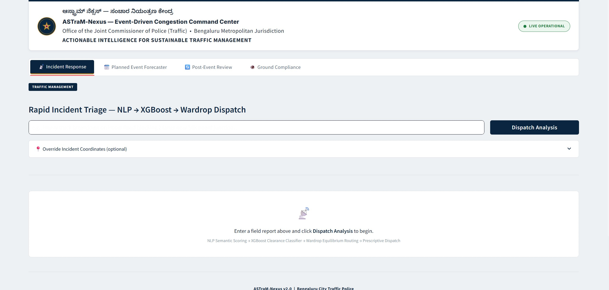

<div align="center">

# 🚨 ASTraM-Nexus
**Zero-Shot Prescriptive AI & Closed-Loop Traffic Orchestrator for Bengaluru Traffic Police (BTP)**

[](https://www.python.org/)
[](https://streamlit.io/)
[](https://xgboost.readthedocs.io/)
[](https://osmnx.readthedocs.io/)

*An event-driven congestion intelligence platform engineered for imperfect data.*

<!-- Replace with a screenshot of your actual Streamlit dashboard -->


</div>

---

## 📌 The Operational Reality
Bengaluru Traffic Police manage over 14,000 km of dense urban road networks. Currently, deployment during unplanned gridlocks or planned events is entirely **experience-driven**. 

When analyzing the historical telemetry for this challenge, we discovered two critical blockers preventing standard Machine Learning approaches:
1. **Extreme Data Sparsity:** Critical operational fields (like manpower assignment and cargo material) suffer from a **98% null rate**.
2. **Administrative Lag:** Ground reality clearance times are heavily corrupted by civic infrastructure tickets (e.g., potholes) left open for months, acting as massive statistical outliers.

Standard predictive models fail here. **We pivoted.**

## 💡 The Solution: ASTraM-Nexus
We built a **sparse-data systems architecture**. By mathematically isolating acute traffic emergencies from civic infrastructure tickets and using p95-informed statistical capping, we corrected administrative time-travel errors. 

ASTraM-Nexus is not just a predictive model; it is a 4-pillar prescriptive command center designed for the BTP Traffic Management Center (TMC).

### ⚙️ Core Pillars
*   📡 **1. Rapid Incident Triage (Unplanned):** A bilingual NLP engine extracts semantic risk (`S_risk`) from messy field reports. A custom XGBoost classifier then predicts the exact **Probability of a Gridlock Shockwave** (Quick, Medium, Long), allowing preemptive action.
*   🗺️ **2. Zero-Shot Dispatch & Wardrop Routing:** Lacking historical dispatch data, we engineered a prescriptive heuristic algorithm that calculates required manpower and dynamically dispatches from the nearest non-saturated station. Simultaneously, our OSRM-powered engine calculates Wardrop equilibrium detours around blocked nodes, generating one-click Google Maps deep links for officers on the ground.
*   🗓️ **3. Planned Event Forecaster:** A predictive crowd-scale analyzer for permit-stage planning, outputting 7-day-ahead deployment forecasts for political rallies, stadium matches, and processions.

*   🔄 **4. Post-Event Learning & Agentic Compliance:** A simulated VLM (Vision-Language Model) pipeline audits CCTV footage to ensure physical barricade compliance matches the digital dispatch plan. Furthermore, a GEH-statistic feedback loop continuously monitors for concept drift, triggering automated incremental learning.

---

## 🏗️ System Architecture & Workflow

```text
Field Report (Text + Coordinates) 
   │
   ├──> [ NLP Module ] ───────> Extracts S_risk (1 to 3 severity)
   │
   ├──> [ XGBoost Engine ] ───> Predicts Gridlock Probability P(Long > 120m)
   │
   ├──> [ Dispatch Matrix ] ──> Zero-Shot Heuristics (Haversine Station Match)
   │
   └──> [ Routing Engine ] ───> OSMnx Node Deletion & Shortest Path Detour
             │
             └───> 💻 Streamlit Command Center UI
```

---

## 🚀 Getting Started

### Prerequisites
Ensure you have Python 3.9+ installed. We recommend using a virtual environment.

### Installation

1. **Clone the repository:**
   ```bash
   git clone https://github.com/yourusername/GridLockROUND-2.git
   cd GridLockROUND-2
   ```

2. **Create a virtual environment (Optional but recommended):**
   ```bash
   python -m venv venv
   source venv/bin/activate  # On Windows use `venv\Scripts\activate`
   ```

3. **Install required dependencies:**
   ```bash
   pip install -r requirements.txt
   ```

### Launch the Command Center
Run the following command to boot the Streamlit application:
```bash
streamlit run app.py
```

*Note: The application features graceful degradation. It will automatically load OSRM routing graphs and the pre-trained XGBoost model if present, but will seamlessly fall back to deterministic heuristics and synthetic rendering if local dependencies fail.*

---